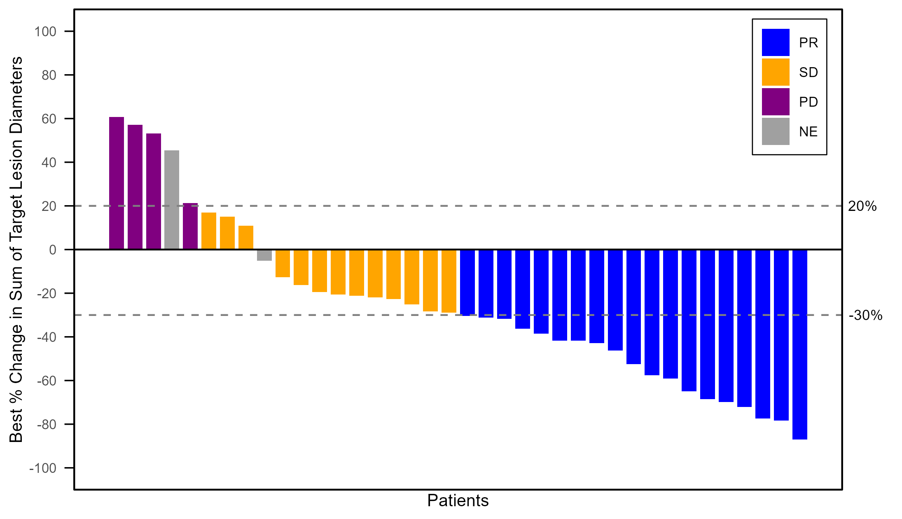
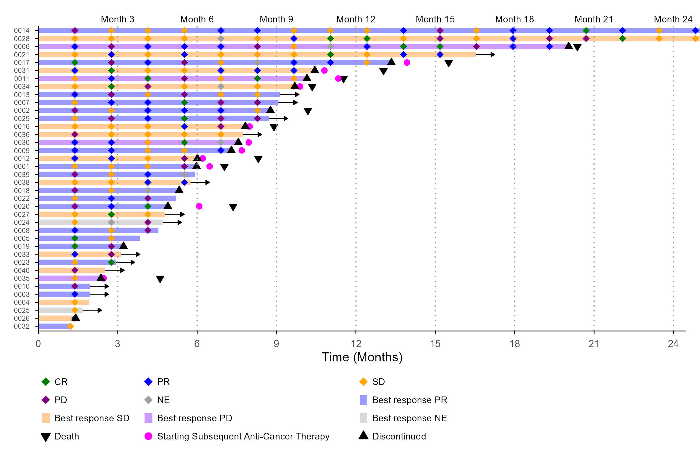
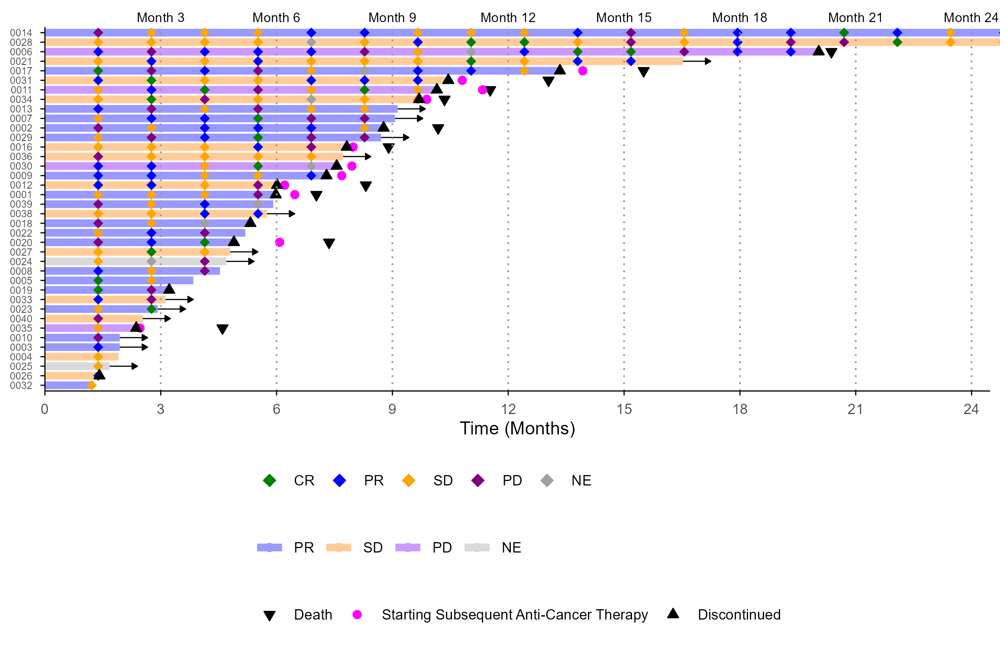
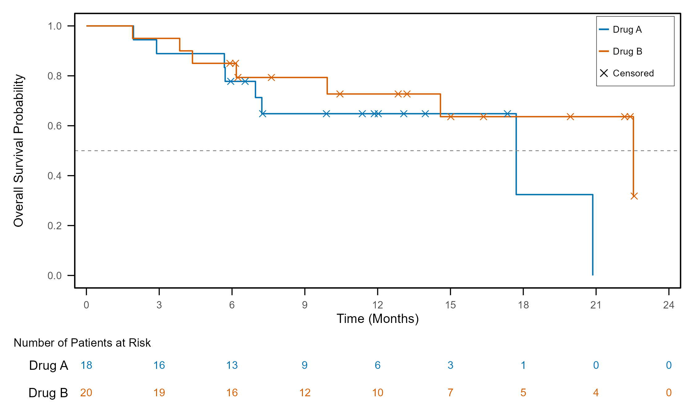

# plotplanner

Generate **ggplot2 / extension-package code** for clinical figures from an **Excel spec**.

plotplanner is not a plotting package: it *writes code*. The goal is a runnable
**skeleton** that is quicker to get than writing ggplot2 by hand — not a perfect
figure. The last details are finished by editing the generated script.

- Pick a **plot type** (base pattern) and add **layer patterns**
- Assign ADaM **variables to roles**; datasets, variables and codelist values are
  **chosen from the ADaM data** (Excel drop-downs)
- Choose **presets**: theme, palette, legend type / position
- The generated script uses only dplyr + ggplot2 (+ ggsurvfit / patchwork), not plotplanner

Status: early development (km / waterfall / swimmer). Design discussion and sample
code: [Discussions](https://github.com/ichirio/plotplanner/discussions).

## Workflow

```r
library(plotplanner)

adam <- read_adam("data/adam")                  # folder of .xpt / .sas7bdat / .rds, or list(adsl = ...)
write_plot_spec_template(adam, "plot_spec.xlsx") # sheets with drop-downs from the ADaM data

# ... fill in plot_spec.xlsx in Excel ...

spec <- read_plot_spec("plot_spec.xlsx")
check_plot_spec(spec, adam)                      # variables / values exist? required roles?
write_plot_code(spec, "programs/figures", adam = adam)
```

Try it without your own data:

```r
adam <- pp_example_adam()   # synthetic ADSL / ADTTE / ADRS / ADTR
spec <- pp_example_spec()   # the three figures below
cat(plot_code(spec, "F-SW-1", adam = adam))
```

| km | waterfall | swimmer |
|---|---|---|
|  |  |  |

## Spec sheets

| sheet | one row = | columns |
|---|---|---|
| `plots` | a figure | `plot_id`, `plot_type`, `dataset`, `layers` (comma separated), `title`, `x_label`, `y_label`, `theme`, `palette`, `legend_type`, `legend_pos`, `width`, `height`, `units`, `dpi` |
| `roles` | a role of a pattern | `plot_id`, `layer` (blank = base), `role`, `dataset` (blank = plot dataset; another dataset is joined by `id_var`), `variable`, `label`, `shape`, `colour` |
| `filters` | a condition | `plot_id`, `layer` (blank = base), `dataset`, `variable`, `value` (several rows for the same variable = `%in%`) |
| `levels` | a codelist value | `plot_id`, `variable`, `value`, `label`, `order`, `colour` |
| `legend` | a legend item | `plot_id`, `order`, `label`, `glyph` (`point` / `line` / `rect`), `shape`, `colour`, `fill`, `linetype` |
| `options` | a setting | `plot_id` (blank = all plots), `key`, `value` |

The template also contains `adam_vars` and `adam_values` (all variables and codelist values of the data).

## Plot types and patterns

| plot_type | base roles | layers (layer roles) |
|---|---|---|
| `km` | `time`, `censor`, `strata`* | `censor_mark`, `ci`, `median_line`, `n_at_risk` |
| `waterfall` | `id`, `value`, `fill`* | `ref_lines`, `ref_labels` |
| `swimmer` | `id`, `end`, `colour`* | `assessment_marker` (`x`, `fill`*), `event_marker` (`x`; one row per event with `label` / `shape` / `colour`), `ongoing_arrow` (uses a filter row), `visit_grid` |

\* optional

## Legends

| `legend_type` | |
|---|---|
| `mapped` | ggplot2 legends of the mapped aesthetics (colour / fill / shape), e.g. bar colour + assessment fill + event shape |
| `manual` | a legend **panel drawn from a table of items**, independent of the data. Items come from the `legend` sheet; when it is empty they are built from the spec (levels, event markers). The items are written into the script as a `tribble`, easy to edit |
| `none` | no legend |

`legend_pos`: `right`, `bottom`, `top`, `left`, `below`, `inside_tr`, `inside_tl`, `inside_br`, `inside_bl`.

| mapped, bottom | manual, inside_tr |
|---|---|
|  |  |

## Presets and options

- `theme`: `boxed` (frame, no grid), `L_axis` (left/bottom axis lines), `minimal`, `classic`
- `palette`: `response`, `response_light`, `treatment`, `okabe_ito`, `grey` — named palettes
  match values by name (CR/PR/SD/PD/NE); `levels` rows override colours, labels and order
- Shapes: `circle`, `square`, `diamond`, `triangle`, `triangle_down`, `x`, `plus`, `dot`, ... or a number
- Options (`options` sheet): `data_expr` (e.g. `adam_data${ds}`), `id_var` (default `USUBJID`),
  `time_unit` (`as_is` / `days_to_weeks` / `days_to_months` / `days_to_years`), `x_max`, `x_by`,
  `y_min`, `y_max`, `y_by`, `ref_lines`, `censor_shape`, `visit_every`, `visit_label`,
  `marker_palette`, `legend_ncol`, `legend_width`, `legend_height`, `legend_title`, `legend_hide`,
  `fig_path`, `base_size`, ...

Out of scope by design: deriving analysis variables (e.g. time from dates / AVISIT). Roles
take variables that already exist in the ADaM data; derive anything else in the script.
