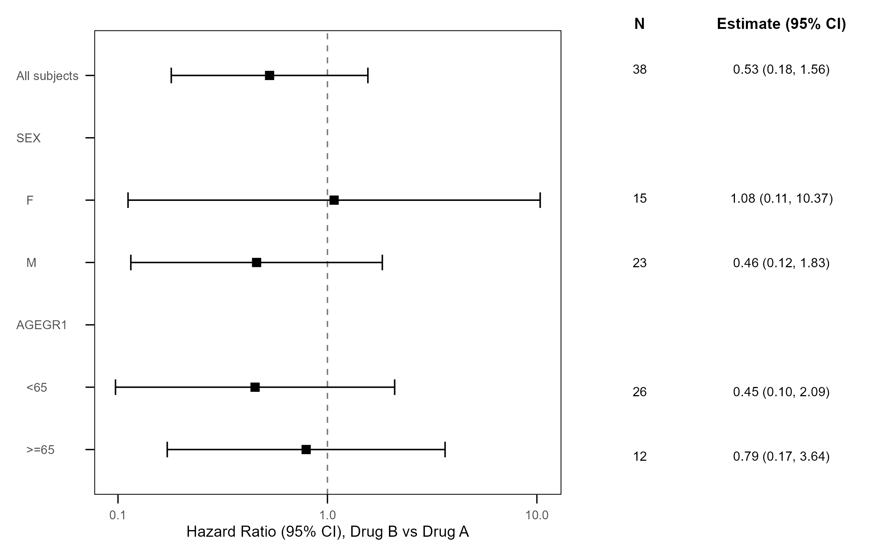
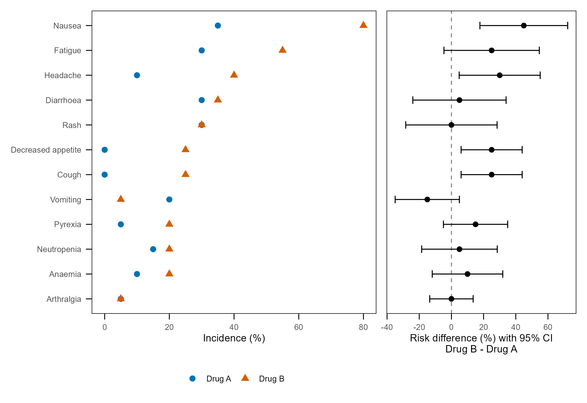
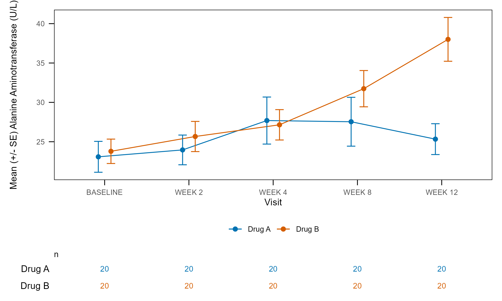
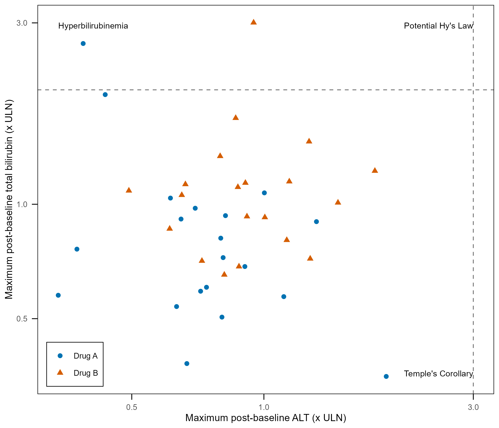
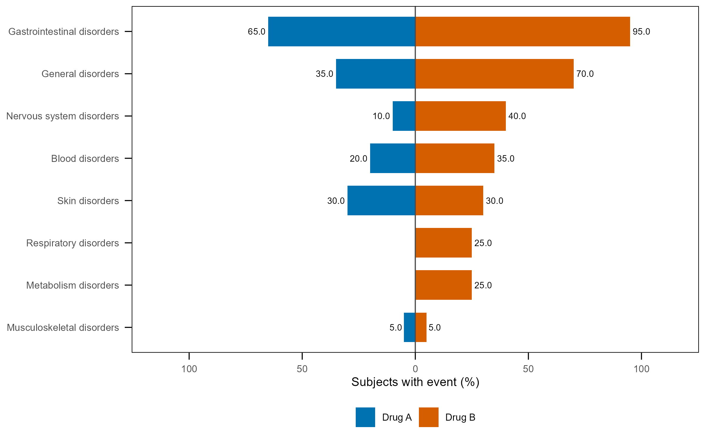
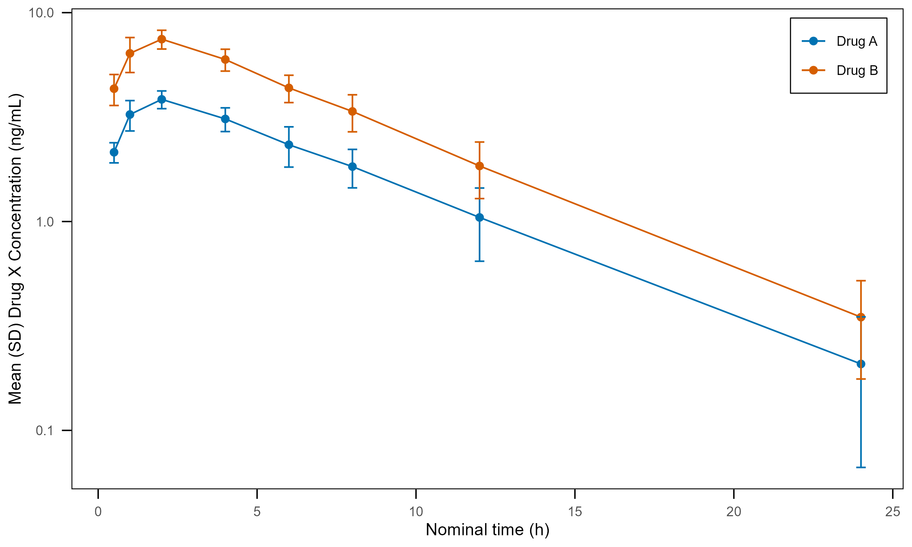
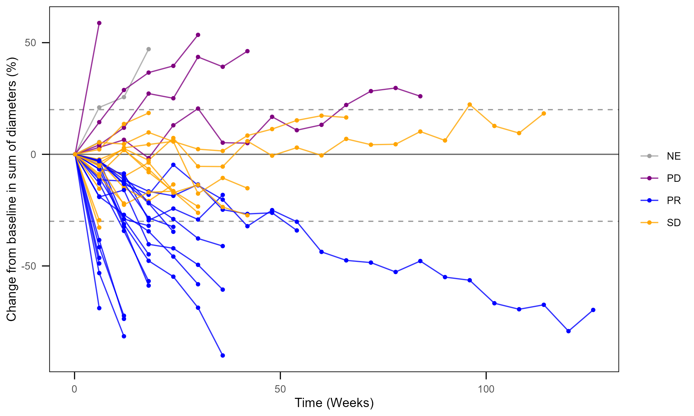
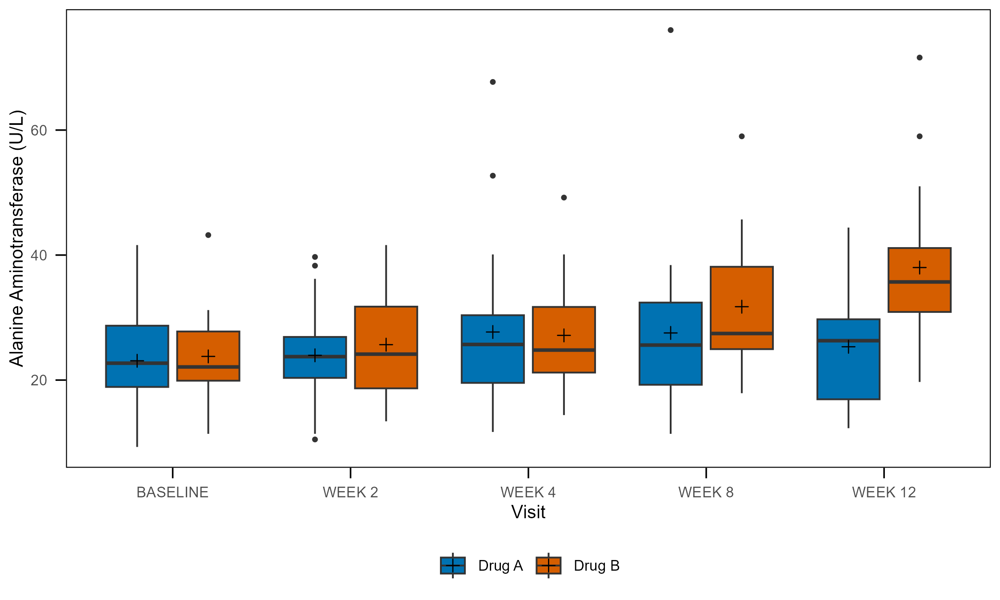
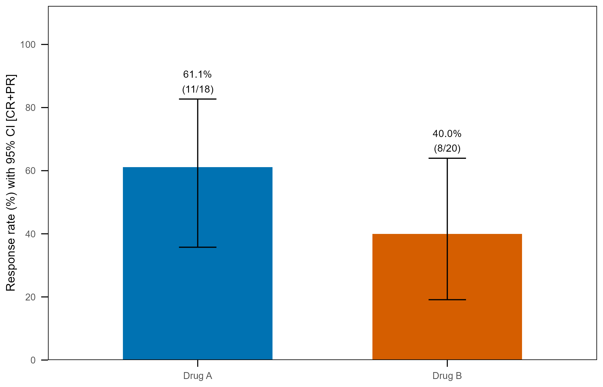

# tflspec

Excel specifications for clinical **tables, listings and figures**. tflspec
decides *what* goes on the page; [rtfreporter](https://github.com/ichirio/rtfreporter)
renders it to RTF, and [tflplanner](https://github.com/ichirio/tflplanner) is the
GUI on top.

```
tflplanner   the GUI; installing it installs the other two
    |
tflspec      Excel / YAML specs -> objects and code (needs rtfreporter at run time)
    |
rtfreporter  the RTF renderer; usable on its own
```

| Part | What it does | Entry points |
|---|---|---|
| Tables | an Excel table spec -> a plan (rtfreporter's `table_plan()`), its pages, or the `table_plan() |> plan_*()` code; a plan back to a spec | `tfl_table_spec()`, `tfl_table_plan()`, `tfl_table_code()`, `tfl_as_table_spec()`, `tfl_read_report_spec()`, `tfl_report()` |
| Listings | an Excel listing spec (sheets `listings`, `listing_cols`) -> the listing program, or its pages | `tfl_read_listing_spec()`, `tfl_listing_code()`, `tfl_listing()` |
| Figures | an Excel plot spec -> a ggplot2 skeleton script | `tfl_fig_spec()`, `tfl_fig_code()`, `tfl_fig_km()`, `tfl_fig_waterfall()`, `tfl_fig_swimmer()` |

A plan is rtfreporter's (`table_plan()`, the `plan_*()` verbs): tflspec
writes and reads the specifications, and rtfreporter (>= 0.8.2) is the
engine that turns an ARD and a plan into RTF pages.  `rtf_tables(doc, plan)`
takes a plan directly.

The column names follow two rules. **Table, listing and report columns
are rtfreporter's argument names** (a `layout` column is the verb's prefix
and its argument: `pages_max_rows` is `plan_paginate_rows(max_rows = )`).
**ARD columns are cards' argument names** (`by`, `variables`, `strata`,
`denominator`), with two exceptions: `statistics` (cards' `statistic`) and
`formats` (tflspec's own). A column whose value has a unit says it
(`_twips`, `_in`, `_half_points`; `rel_width` is a relative width). One
argument is written in one place: a column, or `args`, never both. Every column is
described on its header cell's comment and by `tfl_spec_columns()`.

Working with an AI assistant? Attach `tflspec_ai_manual()` (the manual of
the version you have installed) to the chat session.

Status: early development (0.0.x). Discussion and sample code:
[Discussions](https://github.com/ichirio/tflspec/discussions).

## Tables

```r
library(rtfreporter)   # the table engine and the renderer
library(tflspec)       # the specs

tbl <- ard |>
  normalize_ard() |>
  table_plan(cols = "TRT01A", rows = c(group = "variable")) |>
  plan_cells(continuous = c("n" = "{N:d}", "Mean (SD)" = "{mean} ({sd})"),
             categorical = "{n} ({p:%})") |>
  plan_digits(1)

doc <- rtf_document() |> rtf_tables(tbl)
generate_rtfreport(doc, "t_dm.rtf")
```

The same table from an Excel definition, as an object or as code:

```r
spec <- tfl_read_report_spec(c("report.xlsx", "tables.xlsx"), output_id = "DM")

plan <- tfl_table_plan(data, spec)        # the plan, read from the workbook
doc  <- tfl_report(spec, plan)             # the document around it

tfl_table_code(spec)                       # or the program: table_plan() + plan_*()
tfl_report_code(spec, content = "plan")    #   and rtf_document() + rtf_*()
```

## Listings

A listing is defined in two sheets keyed by `output_id`: `listings` (one row
a listing: `dataset`, `where`, `sort`, `max_rows`, `type`) and `listing_cols`
(one row a printed column: `vars`, `label`, `width`, `collapse_repeats`).
tflplanner's `listing_figure_spec.xlsx` is such a workbook.

```r
spec <- tfl_read_listing_spec("spec/listing_figure_spec.xlsx")

# the program: read the data (catalog), subset, sort, lay out
tfl_listing_code(spec, "L-16-2-7", datasets = catalog)

# or the pages, from data in hand
pages <- tfl_listing(spec, adae, "L-16-2-7")
doc <- rtf_document() |> rtf_tables(pages)
```

Both give the same pages. `tfl_write_listing_spec(tfl_listing_spec(), path)`
writes an empty workbook to fill in.

## Figures

Generate a **ggplot2 skeleton script** for common clinical figures by choosing a
plot type and a **style** — a few arguments instead of a few hundred lines.

tflspec does not try to cover every figure. It writes the ~95% that is the
same every time (data preparation from ADaM, the plot, legend, `ggsave()`), and
you finish the rest by editing the generated script. The script depends only on
dplyr + ggplot2 (+ ggsurvfit / patchwork), not on tflspec — except the
treatment-sequence `sankey` / `sunburst`, which are drawn by tflspec's own
ggplot2 functions (`tfl_plot_sankey()`, `tfl_plot_sunburst()`).

Figure types: see the [catalogue](#catalogue-of-figure-types) below (15 implemented types in 7 clinical categories).

### Quick start

```r
library(tflspec)
adam <- tfl_read_adam("data/adam")     # optional: .xpt / .sas7bdat / .rds folder, or list(adsl = ...)

tfl_fig_km(adam, param = "OS")                                      # print the script
tfl_fig_km(adam, param = "DOR", style = "single_arm", file = "programs/f_km_dor.R")
tfl_fig_waterfall(adam)
tfl_fig_swimmer(adam, events = c(Death = "DTHADY", Discontinued = "EOSDY"), visit_every = 3)
```

Standard ADaM names are assumed (ADTTE `AVAL`/`CNSR`/`PARAMCD`, `TRT01P`,
`FASFL`, ADRS `BOR`/`OVR` in `AVALC`, ADSL `TRTDURD`, ...). Pass an argument only
when your study differs, e.g. `group = "TRT01A"`, `pop = "SAFFL"`, `data = "ADEFF"`.
With `adam`, the group / response values and their colours are written literally
into the script; without it, they are taken from the data when the script runs.

Try it on synthetic data: `adam <- tfl_example_adam()`.

| `tfl_fig_km(adam, x_max = 24, x_by = 3)` | `tfl_fig_km(adam, style = "single_arm")` | `tfl_fig_km(adam, style = "ci", legend = "panel_inside")` |
|---|---|---|
|  |  |  |

| `tfl_fig_waterfall(adam)` | `tfl_fig_swimmer(adam, events = ..., visit_every = 3)` | `tfl_fig_swimmer(adam, style = "response", legend = "inside_bl")` |
|---|---|---|
|  |  |  |

## Catalogue of figure types

`tfl_fig_catalog()` classifies the figure types by clinical category. Each type has
one or more **styles** (subtypes; **bold** = default), and some have argument-level
subtypes (e.g. a swimmer plot with bars from 0 or from a start day). Rows with
status `planned` are classified but not generated yet.

| category | type | style | status | function | draws |
|---|---|---|---|---|---|
| Efficacy: time to event | km | **risk_table** | implemented | `tfl_fig_km()` | KM curves by group + censor marks + median line + number at risk panel — subtypes: time_unit: days / weeks / months / years |
| Efficacy: time to event | km | simple | implemented | `tfl_fig_km()` | KM curves by group + censor marks |
| Efficacy: time to event | km | ci | implemented | `tfl_fig_km()` | KM curves by group + confidence bands + censor marks + number at risk panel |
| Efficacy: time to event | km | single_arm | implemented | `tfl_fig_km()` | One KM curve (no group) + censor marks + median line + number at risk panel |
| Efficacy: time to event | cuminc | **competing_risks** | planned |  | Cumulative incidence with competing risks by group |
| Efficacy: tumour response | waterfall | **response** | implemented | `tfl_fig_waterfall()` | Best % change bars coloured by best overall response + +20% / -30% lines with labels |
| Efficacy: tumour response | waterfall | plain | implemented | `tfl_fig_waterfall()` | Best % change bars in one colour + +20% / -30% lines with labels |
| Efficacy: tumour response | swimmer | **full** | implemented | `tfl_fig_swimmer()` | Bars coloured by BOR + response at each assessment + event markers + ongoing arrows — subtypes: origin: bars from 0 (duration, default) / from start to end (start, end) |
| Efficacy: tumour response | swimmer | assessment | implemented | `tfl_fig_swimmer()` | Bars coloured by BOR + response at each assessment + ongoing arrows — subtypes: origin: from 0 / from start |
| Efficacy: tumour response | swimmer | response | implemented | `tfl_fig_swimmer()` | Bars coloured by BOR + ongoing arrows — subtypes: origin: from 0 / from start |
| Efficacy: tumour response | swimmer | bar | implemented | `tfl_fig_swimmer()` | Bars in one colour + ongoing arrows — subtypes: origin: from 0 / from start |
| Efficacy: tumour response | individual | spider | implemented | `tfl_fig_individual()` | % change in tumour size over time per subject, coloured by BOR, +20% / -30% lines — subtypes: time_unit: days / weeks / months |
| Efficacy: subgroups and rates | forest | **hr** | implemented | `tfl_fig_forest()` | Cox hazard ratio (95% CI) overall and by subgroup + N / estimate text columns |
| Efficacy: subgroups and rates | forest | or | implemented | `tfl_fig_forest()` | Odds ratio of response (95% CI) overall and by subgroup + text columns |
| Efficacy: subgroups and rates | forest | estimates | implemented | `tfl_fig_forest()` | Forest plot of pre-computed estimates (label, est, lcl, ucl) |
| Efficacy: subgroups and rates | bar | **rate_ci** | implemented | `tfl_fig_bar()` | Response rate by group with exact 95% CI and n/N labels |
| Efficacy: subgroups and rates | bar | stacked | implemented | `tfl_fig_bar()` | 100% stacked bars of a category (e.g. BOR) by group |
| Efficacy: subgroups and rates | bar | dodged | implemented | `tfl_fig_bar()` | Percent of subjects per category, groups side by side |
| Longitudinal | mean | **se** | implemented | `tfl_fig_mean()` | Mean +/- SE by visit and group (dodged) — subtypes: value: AVAL / CHG / PCHG |
| Longitudinal | mean | sd | implemented | `tfl_fig_mean()` | Mean +/- SD by visit and group |
| Longitudinal | mean | ci | implemented | `tfl_fig_mean()` | Mean with 95% CI by visit and group |
| Longitudinal | mean | se_n | implemented | `tfl_fig_mean()` | Mean +/- SE by visit and group + table of n below |
| Longitudinal | individual | **spaghetti** | implemented | `tfl_fig_individual()` | One line per subject by visit, coloured by group, with group means |
| Longitudinal | box | **by_visit** | implemented | `tfl_fig_box()` | Box plots by visit and group + mean marker |
| Longitudinal | box | by_group | implemented | `tfl_fig_box()` | Box plot per group at one visit + data points + mean marker |
| Longitudinal | box | change | implemented | `tfl_fig_box()` | Box plots of change from baseline by visit and group + zero line |
| Longitudinal | lsmeans | **mmrm** | planned |  | Model-based LS means (95% CI) over time by group |
| Safety | ae_dot | **risk_diff** | implemented | `tfl_fig_ae_dot()` | Incidence by preferred term (two arms) + risk difference with 95% CI |
| Safety | ae_dot | incidence | implemented | `tfl_fig_ae_dot()` | Incidence by preferred term by arm |
| Safety | butterfly | **soc** | implemented | `tfl_fig_butterfly()` | Incidence by system organ class, two arms mirrored |
| Safety | butterfly | pt | implemented | `tfl_fig_butterfly()` | Incidence by preferred term (top N), two arms mirrored |
| Safety | edish | **alt** | implemented | `tfl_fig_edish()` | Max ALT vs max total bilirubin (x ULN, log axes) + Hy's law lines and quadrants |
| Safety | edish | alt_ast | implemented | `tfl_fig_edish()` | Max of ALT / AST vs max total bilirubin (x ULN) + Hy's law lines |
| Safety | shift_heatmap | **worst_grade** | planned |  | Baseline vs worst post-baseline grade counts as a heatmap |
| Safety | patient_profile | **timeline** | planned |  | One subject: dosing, AEs and labs on a shared time axis |
| PK / PD | pk | **mean** | implemented | `tfl_fig_pk()` | Mean +/- SD concentration by nominal time and group |
| PK / PD | pk | mean_log | implemented | `tfl_fig_pk()` | Mean +/- SD concentration, log axis |
| PK / PD | pk | individual | implemented | `tfl_fig_pk()` | Individual concentration-time profiles, log axis, one panel per group |
| PK / PD | qtc_conc | **scatter_fit** | planned |  | Change in QTc vs concentration with a linear fit |
| PK / PD | dose_response | **emax** | planned |  | Response by dose with a fitted Emax curve |
| Distribution / association | scatter | **shift** | implemented | `tfl_fig_scatter()` | Baseline vs post-baseline value at one visit + identity line |
| Distribution / association | scatter | xy | implemented | `tfl_fig_scatter()` | Two variables with a linear fit per group |
| Distribution / association | histogram | **by_group** | planned |  | Histogram / density of a variable by group |
| Distribution / association | roc | **biomarker** | planned |  | ROC curve of a biomarker with AUC |
| Treatment patterns | sankey | **grey_links** | implemented | `tfl_fig_sankey()` | Treatment-line nodes (subjects per line x category) + links in light grey |
| Treatment patterns | sankey | colored_links | implemented | `tfl_fig_sankey()` | Treatment-line nodes + links in the colour of their source node |
| Treatment patterns | sankey | subgroups | implemented | `tfl_fig_sankey()` | One sankey per subgroup (`by`) on a shared scale, side by side |
| Treatment patterns | sunburst | **rings** | implemented | `tfl_fig_sunburst()` | One ring per line (inner = first line); arcs = subjects, gaps = no further line |

More styles of the same type are cheap to add: tell us which ones you need in the
[Discussions](https://github.com/ichirio/tflspec/discussions).

| `tfl_fig_forest(adam)` | `tfl_fig_ae_dot(adam)` | `tfl_fig_mean(adam, style = "se_n")` |
|---|---|---|
|  |  |  |

| `tfl_fig_edish(adam)` | `tfl_fig_butterfly(adam)` | `tfl_fig_pk(adam, style = "mean_log")` |
|---|---|---|
|  |  |  |

| `tfl_fig_individual(adam, style = "spider")` | `tfl_fig_box(adam)` | `tfl_fig_bar(adam)` |
|---|---|---|
|  |  |  |

Conventions of the generated scripts: population, group and subgroup variables
are always taken from ADSL (joined by `USUBJID`), so BDS datasets need not carry
them; `param` selects `PARAMCD`; `pop` is a `== "Y"` flag (`NULL` for none).

## Treatment sequences: sankey and sunburst

Input: one row per subject and line (e.g. lines of therapy), default dataset
`ADLOT` with `USUBJID`, `LINE` and `TRT` (change with `data`, `stage`, `category`).

```r
tfl_fig_sankey(adam)                                          # grey links
tfl_fig_sankey(adam, style = "colored_links")
tfl_fig_sankey(adam, style = "subgroups", by = "AGEGR1")
tfl_fig_sunburst(adam)
```

The scripts call `tfl_sankey_data()` / `tfl_sunburst_data()` (nodes, links and paths
from the line data) and `tfl_plot_sankey()` / `tfl_plot_sankey_batch()` /
`tfl_plot_sunburst()` (moved here from ydisctools), which can also be used directly.

| `tfl_fig_sankey(adam, style = "colored_links")` | `tfl_fig_sankey(adam, style = "subgroups", by = "AGEGR1")` | `tfl_fig_sunburst(adam)` |
|---|---|---|
|  |  |  |

## Legends

`legend =`

| value | legend |
|---|---|
| `none` | no legend |
| `right`, `bottom`, `inside`, `inside_bl` | ggplot2 legend of the mapped colours / fills / shapes |
| `panel`, `panel_right`, `panel_inside` | a legend **panel drawn from an item table**, independent of the data (like hand-made legends in study figures). The items are written into the script as a `tribble` — add, remove or relabel rows by hand |

## Figure style standard

Every look-and-feel value of a figure -- font sizes, line widths, ticks,
reference lines, the censor mark, palettes, event markers, the output size --
is one catalog, `tfl_fig_style()` (sheets `settings`, `colors`, `markers`), so
every figure of a study looks the same.  The built-in one comes from the KM /
waterfall / swimmer sample programs the generators were built from; a company
keeps its own in a workbook:

```r
tfl_fig_style_template("fig_style.xlsx")                      # the built-in one, to edit
options(tflspec.fig_style = tfl_read_fig_style("fig_style.xlsx"))
```

The generators take their defaults from it.  For figure programs written by
hand (or by an AI), `tfl_fig_setup_code()` writes the same style as plain ggplot2
helpers -- `theme_tfl()`, `scale_colour_tfl()`, `tfl_marker()`, `tfl_save()`
-- and `tfl_check()`, which warns about dropped rows, legend colours that are
not the standard's and a legend in the wrong order (`tfl_check_fig()` runs it
from R).  `tfl_fig_km(ard = )` reads the number at risk from the KM table's ARD, so
the figure and the table agree.

## Common arguments and options

- `title`, `pop` (population flag, `NULL` = none), `time_unit` (`days` / `weeks` / `months` / `years`), `file`, `plot_id`
- `...`: `x_max`, `x_by`, `y_min`, `y_max`, `y_by`, `ref_lines` (`"20,-30"`), `palette`
  (`treatment`, `response`, `response_light`, `okabe_ito`, `grey`), `theme` (`boxed`, `L_axis`,
  `minimal`, `classic`), `width`, `height`, `units`, `dpi`, `censor_shape`, `legend_ncol`, ...
- Set once per study:

```r
options(
  tflspec.data_expr = "adam_data${ds}",                          # how the script gets ADTTE etc.
  tflspec.fig_path  = 'file.path(output_path, "{plot_id}.png")'  # where it saves
)
```

## Many figures: Excel plot list

One row per figure, columns = the arguments above.

```r
tfl_fig_list_template("plot_list.xlsx", adam)   # drop-downs for type, style, legend, PARAMCD, group, pop
tfl_fig_list_code("plot_list.xlsx", adam, dir = "programs/figures")
```

| plot_id | type | style | title | param | group | pop | legend | args |
|---|---|---|---|---|---|---|---|---|
| F-14.2.1 | km | risk_table | | OS | TRT01P | | | `x_max = 24, x_by = 3` |
| F-14.2.2 | waterfall | response | | | | | | |
| F-14.2.3 | swimmer | full | | | | | | `events = c(Death = "DTHADY")` |

Blank = default. `args` takes any further argument in R syntax.

## Advanced: detailed spec

The quick API is built on a detailed spec (plots / roles / filters / levels /
legend / options sheets) that can express other combinations of patterns:
`tfl_fig_spec_template()`, `tfl_read_fig_spec()`, `tfl_check_fig_spec()`,
`tfl_fig_code()`. See `?tfl_fig_code` and `tfl_example_fig_spec()`.

Out of scope by design: deriving analysis variables (e.g. time from dates or
AVISIT). Use variables that exist in the ADaM data and derive the rest in the script.
