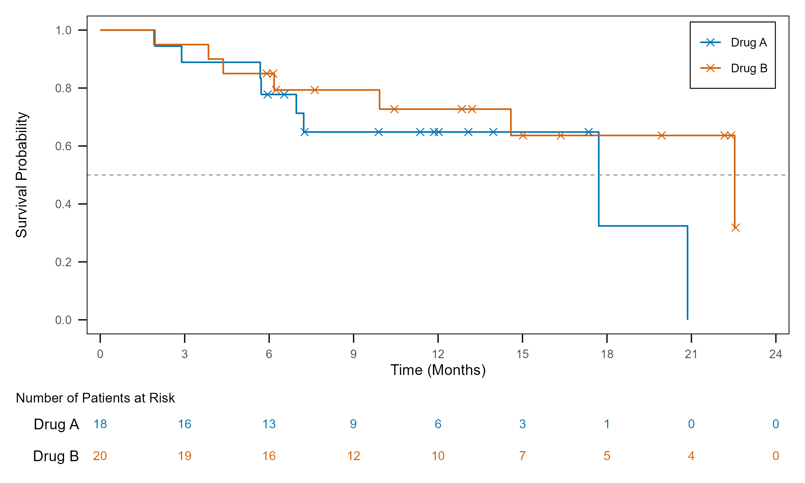
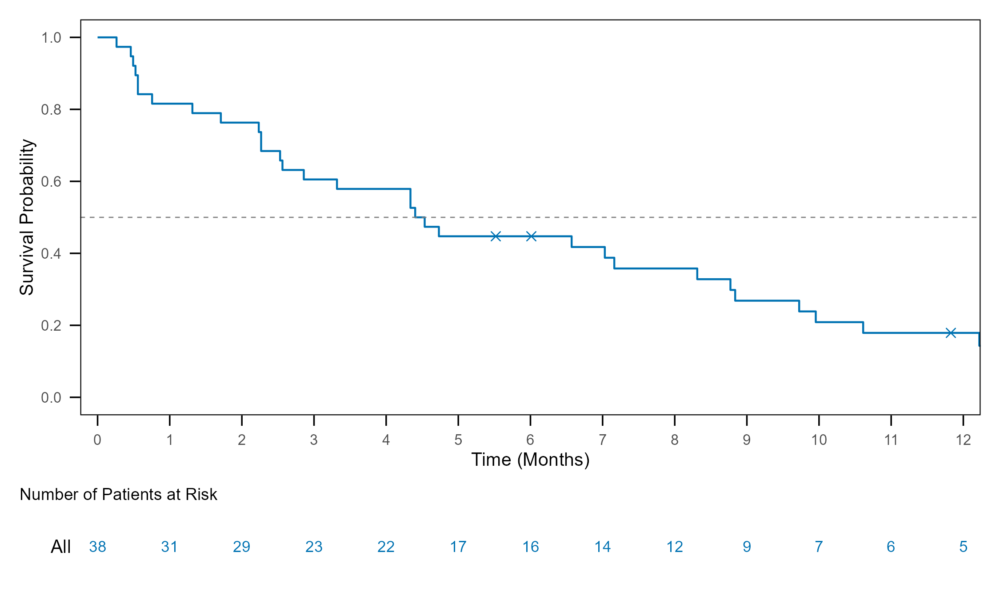
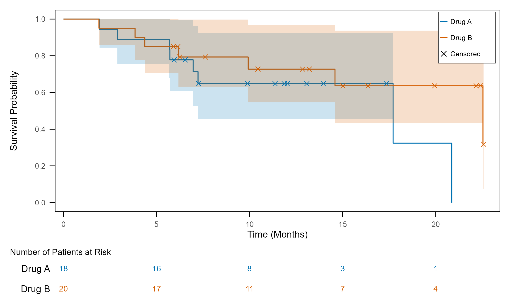
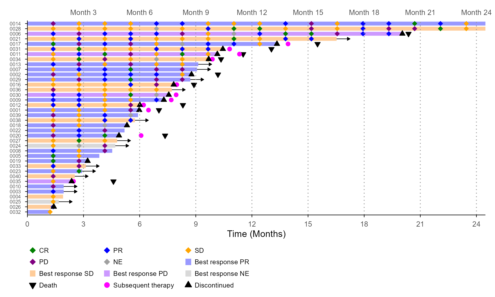
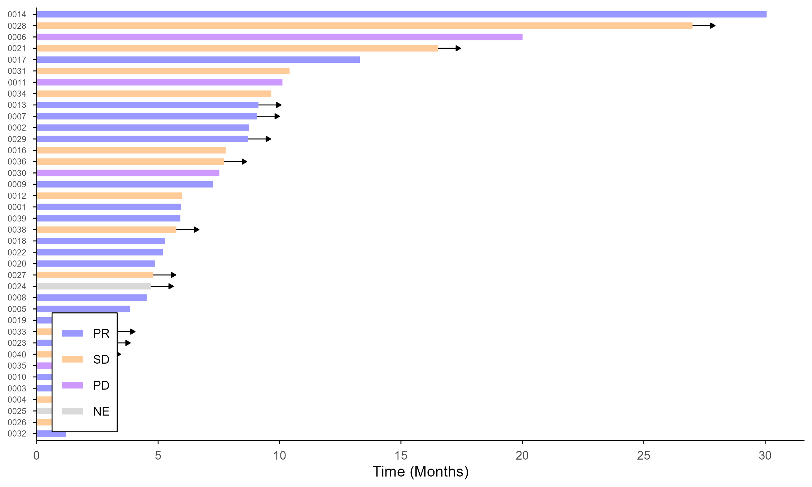
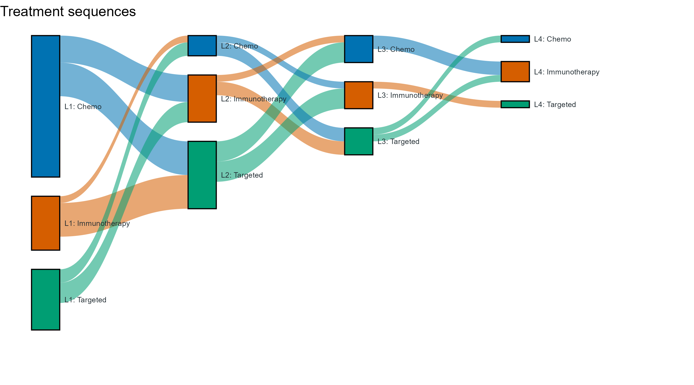
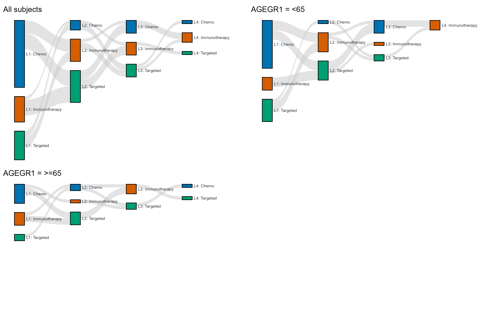
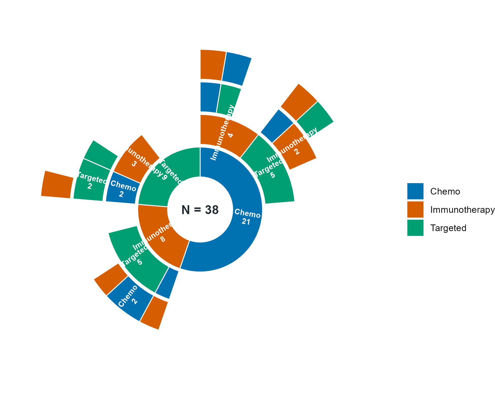

# tflspec

Excel specifications for clinical **tables, listings and figures**. tflspec
decides *what* goes on the page; [rtfreporter](https://github.com/ichirio/rtfreporter)
renders it to RTF, and [tflplanner](https://github.com/ichirio/tflplanner) is the
GUI on top.

```
tflplanner   the GUI; installing it installs the other two
    |
tflspec      for programmers: library(tflspec) also attaches rtfreporter
    |
rtfreporter  the RTF renderer; usable on its own
```

| Part | What it does | Entry points |
|---|---|---|
| Tables (ARD) | a cards/cardx ARD -> a table data.frame -> rtfreporter pages, declared once as a plan or in an Excel table spec | `ard_normalize()`, `ard_spread()`, `rtf_plan()` + `plan_*()`, `table_spec()`, `read_report_spec()`, `rtf_report()` |
| Figures | an Excel plot spec -> a ggplot2 skeleton script | `plot_spec()`, `plot_code()`, `pp_km()`, `pp_waterfall()`, `pp_swimmer()` |

A plan is a table source for rtfreporter: `rtf_tables(doc, plan)` and
`rtfreporter::as_rtftables(plan)` both accept it (tflspec registers an
`as_rtftables()` method).

Status: early development. The table half moved here from rtfreporter's
`feat/474-ard-experimental` branch (ichirio/rtfreporter#474); the figure half
was tflspec. Discussion and sample code:
[Discussions](https://github.com/ichirio/tflspec/discussions).

## Tables

```r
library(tflspec)     # attaches rtfreporter too (Depends)

tbl <- ard |>
  ard_normalize() |>
  rtf_plan(cols = "TRT01A", rows = c(group = "variable")) |>
  plan_cells(continuous = c("n" = "{N:d}", "Mean (SD)" = "{mean} ({sd})"),
             categorical = "{n} ({p:%})") |>
  plan_digits(1)

doc <- rtf_document() |> rtf_tables(tbl)
generate_rtfreport(doc, "t_dm.rtf")
```

## Figures

Generate a **ggplot2 skeleton script** for common clinical figures by choosing a
plot type and a **style** — a few arguments instead of a few hundred lines.

tflspec does not try to cover every figure. It writes the ~95% that is the
same every time (data preparation from ADaM, the plot, legend, `ggsave()`), and
you finish the rest by editing the generated script. The script depends only on
dplyr + ggplot2 (+ ggsurvfit / patchwork), not on tflspec — except the
treatment-sequence `sankey` / `sunburst`, which are drawn by tflspec's own
ggplot2 functions (`plot_sankey()`, `plot_sunburst()`).

Figure types so far: `km`, `waterfall`, `swimmer`, `sankey`, `sunburst`.

### Quick start

```r
library(tflspec)
adam <- read_adam("data/adam")     # optional: .xpt / .sas7bdat / .rds folder, or list(adsl = ...)

pp_km(adam, param = "OS")                                      # print the script
pp_km(adam, param = "DOR", style = "single_arm", file = "programs/f_km_dor.R")
pp_waterfall(adam)
pp_swimmer(adam, events = c(Death = "DTHADY", Discontinued = "EOSDY"), visit_every = 3)
```

Standard ADaM names are assumed (ADTTE `AVAL`/`CNSR`/`PARAMCD`, `TRT01P`,
`FASFL`, ADRS `BOR`/`OVR` in `AVALC`, ADSL `TRTDURD`, ...). Pass an argument only
when your study differs, e.g. `group = "TRT01A"`, `pop = "SAFFL"`, `data = "ADEFF"`.
With `adam`, the group / response values and their colours are written literally
into the script; without it, they are taken from the data when the script runs.

Try it on synthetic data: `adam <- pp_example_adam()`.

| `pp_km(adam, x_max = 24, x_by = 3)` | `pp_km(adam, style = "single_arm")` | `pp_km(adam, style = "ci", legend = "panel_inside")` |
|---|---|---|
|  |  |  |

| `pp_waterfall(adam)` | `pp_swimmer(adam, events = ..., visit_every = 3)` | `pp_swimmer(adam, style = "response", legend = "inside_bl")` |
|---|---|---|
|  |  |  |

## Styles

| type | style | draws |
|---|---|---|
| km | **risk_table** | curves by group + censor marks + median line + number at risk panel |
| km | simple | curves by group + censor marks |
| km | ci | curves by group + confidence bands + censor marks + number at risk panel |
| km | single_arm | one curve + censor marks + median line + number at risk panel |
| waterfall | **response** | bars coloured by best overall response + +20% / -30% lines with labels |
| waterfall | plain | bars in one colour + +20% / -30% lines with labels |
| swimmer | **full** | bars coloured by BOR + response at each assessment + event markers + ongoing arrows |
| swimmer | assessment | bars coloured by BOR + response at each assessment + ongoing arrows |
| swimmer | response | bars coloured by BOR + ongoing arrows |
| swimmer | bar | bars in one colour + ongoing arrows |
| sankey | **grey_links** | treatment-line nodes (subjects per line x category) + links in light grey |
| sankey | colored_links | treatment-line nodes + links in the colour of their source node |
| sankey | subgroups | one sankey per subgroup (`by`) on a shared scale, side by side |
| sunburst | **rings** | one ring per line (inner = first line); arcs = subjects, gaps = no further line |

**Bold** = default. `pp_styles()` lists them.

## Treatment sequences: sankey and sunburst

Input: one row per subject and line (e.g. lines of therapy), default dataset
`ADLOT` with `USUBJID`, `LINE` and `TRT` (change with `data`, `stage`, `category`).

```r
pp_sankey(adam)                                          # grey links
pp_sankey(adam, style = "colored_links")
pp_sankey(adam, style = "subgroups", by = "AGEGR1")
pp_sunburst(adam)
```

The scripts call `sankey_data()` / `sunburst_data()` (nodes, links and paths
from the line data) and `plot_sankey()` / `plot_sankey_subgroups_batch()` /
`plot_sunburst()` (moved here from ydisctools), which can also be used directly.

| `pp_sankey(adam, style = "colored_links")` | `pp_sankey(adam, style = "subgroups", by = "AGEGR1")` | `pp_sunburst(adam)` |
|---|---|---|
|  |  |  |

## Legends

`legend =`

| value | legend |
|---|---|
| `none` | no legend |
| `right`, `bottom`, `inside`, `inside_bl` | ggplot2 legend of the mapped colours / fills / shapes |
| `panel`, `panel_right`, `panel_inside` | a legend **panel drawn from an item table**, independent of the data (like hand-made legends in study figures). The items are written into the script as a `tribble` — add, remove or relabel rows by hand |

## Common arguments and options

- `title`, `pop` (population flag, `NULL` = none), `time_unit` (`days` / `weeks` / `months` / `years`), `file`, `plot_id`
- `...`: `x_max`, `x_by`, `y_min`, `y_max`, `y_by`, `ref_lines` (`"20,-30"`), `palette`
  (`treatment`, `response`, `response_light`, `okabe_ito`, `grey`), `theme` (`boxed`, `L_axis`,
  `minimal`, `classic`), `width`, `height`, `units`, `dpi`, `censor_shape`, `legend_ncol`, ...
- Set once per study:

```r
options(
  tflspec.data_expr = "adam_data${ds}",                          # how the script gets ADTTE etc.
  tflspec.fig_path  = 'file.path(output_path, "{plot_id}.png")'  # where it saves
)
```

## Many figures: Excel plot list

One row per figure, columns = the arguments above.

```r
write_plot_list_template("plot_list.xlsx", adam)   # drop-downs for type, style, legend, PARAMCD, group, pop
plot_list_code("plot_list.xlsx", adam, dir = "programs/figures")
```

| plot_id | type | style | title | param | group | pop | legend | args |
|---|---|---|---|---|---|---|---|---|
| F-14.2.1 | km | risk_table | | OS | TRT01P | | | `x_max = 24, x_by = 3` |
| F-14.2.2 | waterfall | response | | | | | | |
| F-14.2.3 | swimmer | full | | | | | | `events = c(Death = "DTHADY")` |

Blank = default. `args` takes any further argument in R syntax.

## Advanced: detailed spec

The quick API is built on a detailed spec (plots / roles / filters / levels /
legend / options sheets) that can express other combinations of patterns:
`write_plot_spec_template()`, `read_plot_spec()`, `check_plot_spec()`,
`plot_code()`. See `?plot_code` and `pp_example_spec()`.

Out of scope by design: deriving analysis variables (e.g. time from dates or
AVISIT). Use variables that exist in the ADaM data and derive the rest in the script.
